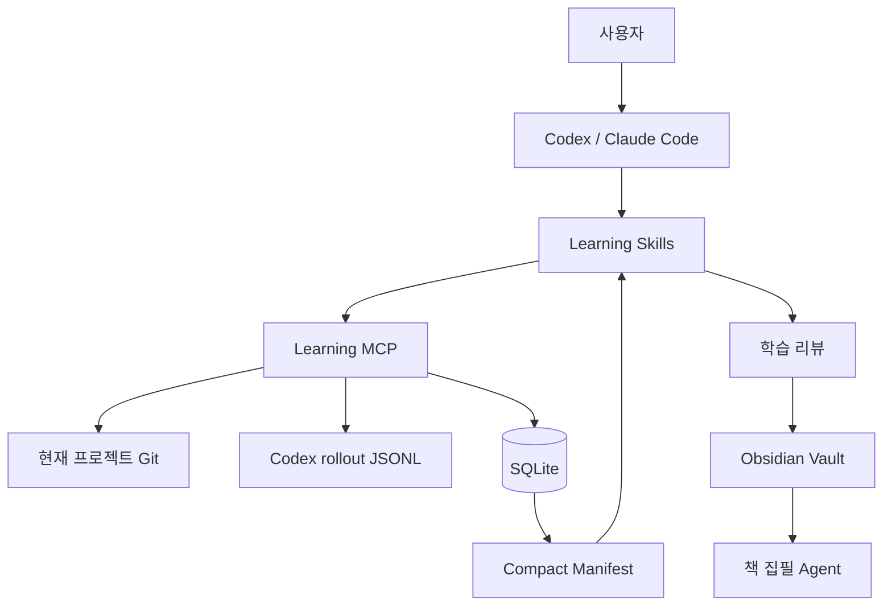

# Learning MCP

AI와 함께 개발한 과정을 feature 단위로 기록하고, Git 변경 사항·AI 대화·토큰 사용량·기술적 판단·디버깅 과정을 학습 리뷰로 바꾸는 로컬 MCP 서버입니다.

단순히 “AI가 코드를 얼마나 작성했는가”를 계산하는 도구가 아닙니다. 사용자가 요구사항, 아키텍처, 구현, 디버깅, 테스트 중 무엇을 직접 판단했고 무엇을 AI와 함께 처리했는지 증거를 바탕으로 되돌아보는 것이 목적입니다.

## 목차

- [왜 만들었는가](#왜-만들었는가)
- [주요 기능](#주요-기능)
- [전체 구조와 동작 방식](#전체-구조와-동작-방식)
- [설치](#설치)
- [Codex에 MCP 등록](#codex에-mcp-등록)
- [Skills 설치](#skills-설치)
- [실제 사용 방법](#실제-사용-방법)
- [MCP 도구](#mcp-도구)
- [토큰과 대화 기록 방식](#토큰과-대화-기록-방식)
- [Obsidian과 책 집필 연결](#obsidian과-책-집필-연결)
- [구현 상세](#구현-상세)
- [테스트](#테스트)
- [현재 한계와 주의사항](#현재-한계와-주의사항)
- [문제 해결](#문제-해결)

## 왜 만들었는가

AI를 사용하면 비개발자도 빠르게 코드를 만들 수 있지만, 결과만 받아서 붙여 넣으면 다음 능력을 기르기 어렵습니다.

- 기능을 개발 가능한 크기로 나누는 능력
- 요구사항과 성공 조건을 정의하는 능력
- 기술과 아키텍처를 비교하고 선택하는 능력
- 코드가 실행되는 흐름을 설명하는 능력
- 오류에 대한 가설을 세우고 검증하는 능력
- AI가 작성한 코드를 검증하고 수정하는 능력

Learning MCP는 개발 결과보다 **개발 중 내린 판단과 검증 과정**을 남깁니다. feature가 끝나면 그 기록을 기반으로 다음 질문에 답합니다.

- 무엇을 만들었는가?
- 어떤 코드를 왜 변경했는가?
- 실행 흐름은 어떻게 되는가?
- 사용자가 직접 판단한 부분은 무엇인가?
- AI에 맡겼지만 사용자가 검증한 부분은 무엇인가?
- 다른 기술이나 더 단순한 방법은 없었는가?
- 어떤 오류를 어떤 가설로 해결했는가?
- 다음에 무엇을 공부해야 하는가?
- 이전 feature에서도 반복된 약점이 있는가?

## 주요 기능

| 기능 | 설명 |
|---|---|
| Feature 단위 기록 | 목표, 성공 조건, 사용자 담당 범위, AI 허용 범위를 개발 전에 선언합니다. |
| 다중 프로젝트 분리 | 서버와 DB는 하나를 공유하고, 각 호출의 현재 Git 루트로 프로젝트를 구분합니다. |
| 기술 결정 기록 | 선택한 기술, 선택 이유, 검토한 대안, 실제 결정 주체를 기록합니다. |
| 디버깅 훈련 | 증상, 가설, 최소 검증 방법, 결과와 상태를 기록합니다. |
| Git 증거 수집 | 기준 commit, branch, working/staged diff, 특정 commit을 필요할 때만 조회합니다. |
| Codex 대화 인덱싱 | feature 시작 이후 사용자·AI 메시지를 rollout JSONL에서 가져와 evidence로 저장합니다. |
| Feature별 토큰 집계 | Codex의 누적 token snapshot에서 시작값과 현재값의 차이를 계산합니다. |
| 토큰 절약형 리뷰 | 작은 manifest를 먼저 읽고 필요한 evidence만 선택 조회합니다. |
| 학습 기여도 리뷰 | 요구사항, 아키텍처, 구현, 디버깅, 테스트를 사람·AI 기여도로 구분합니다. |
| 반복 약점 추적 | 과거 리뷰의 약점과 다음 학습 주제를 프로젝트별로 요약합니다. |
| Obsidian 내보내기 | 검토 결과를 프로젝트/feature별 Markdown 파일로 저장합니다. |
| 책 집필 연결 | 검증된 feature만 증거 묶음으로 만들어 기존 책 집필 Agent에 전달합니다. |

## 핵심 원칙

1. MCP는 증거 수집과 저장을 담당하고, 리뷰 판단은 Codex/Claude 같은 상위 Agent가 담당합니다.
2. 전체 대화와 전체 diff를 매번 읽지 않고 `manifest → selected evidence` 순서로 조회합니다.
3. 토큰 수를 AI 의존도나 사용자의 실력 점수로 해석하지 않습니다.
4. 사용자의 기여는 코드 작성량이 아니라 판단, 설명, 검증 증거로 평가합니다.
5. AI가 작성한 코드도 사용자가 흐름을 설명하고 테스트했다면 `ai-led-verified`로 구분합니다.
6. 검증되지 않은 feature 리뷰를 실제 경험처럼 책에 사용하지 않습니다.
7. 여러 프로젝트가 서버 하나를 공유하더라도 Git 증거는 feature에 저장된 프로젝트 루트에서만 읽습니다.

## 전체 구조와 동작 방식



### 하나의 서버로 여러 프로젝트를 구분하는 방법

`LEARNING_MCP_PROJECT_ROOT`를 서버 설정에 고정하지 않습니다. `learning-session` skill이 현재 Codex 작업에서 다음 명령으로 대상 저장소를 확인합니다.

```bash
git rev-parse --show-toplevel
```

그 절대경로를 `start_feature.project_root`에 전달합니다. 서버는 받은 경로를 다시 `git rev-parse --show-toplevel`로 정규화하고, 실제 Git 저장소인지 검증한 뒤 feature에 저장합니다.

```text
Project A 작업 → project_root=/projects/a → Feature A
Project B 작업 → project_root=/projects/b → Feature B
                                      ↓
                         공용 Learning MCP + SQLite
```

이후 diff, branch, commit 조회는 호출 당시 현재 폴더가 아니라 **feature에 저장된 project root**를 사용합니다. 따라서 서로 다른 프로젝트에서 feature를 동시에 하나씩 진행할 수 있습니다.

안전 규칙은 다음과 같습니다.

- `start_feature.project_root`는 필수입니다.
- 하위 폴더를 전달해도 Git 최상위 폴더로 변환합니다.
- 존재하지 않는 폴더나 Git 저장소가 아닌 폴더는 거부합니다.
- 프로젝트 하나에는 동시에 active feature 하나만 허용합니다.
- 서로 다른 프로젝트에는 active feature가 각각 존재할 수 있습니다.

## 요구 사항

- macOS 또는 Linux
- Git
- Python 3.10 이상
- [`uv`](https://docs.astral.sh/uv/)
- MCP를 지원하는 Codex 또는 Claude Code 등의 host
- 선택 사항: Obsidian Vault

## 설치

현재 프로젝트 위치:

```text
/Users/juks86/Documents/Codex/2026-08-24/learning-mcp
```

의존성을 설치하고 SQLite DB를 초기화합니다.

```bash
cd /Users/juks86/Documents/Codex/2026-08-24/learning-mcp
uv sync
uv run learning-mcp-cli init
```

기본 DB 위치:

```text
/Users/juks86/Documents/Codex/2026-08-24/learning-mcp/data/learning.db
```

직접 서버를 실행해보려면 다음 명령을 사용합니다. stdio MCP 서버이므로 정상 실행 중에는 일반 웹 서버처럼 주소를 출력하지 않고 입력을 기다릴 수 있습니다.

```bash
uv run learning-mcp
```

## 환경 변수

| 환경 변수 | 역할 | 기본값 |
|---|---|---|
| `LEARNING_MCP_HOME` | 서버 데이터 기준 폴더 | Learning MCP 저장소 루트 |
| `LEARNING_MCP_DB` | SQLite DB 절대경로 | `<home>/data/learning.db` |
| `LEARNING_MCP_OBSIDIAN_VAULT` | 리뷰를 내보낼 Obsidian Vault | 미설정 시 내보내지 않음 |
| `LEARNING_MCP_CODEX_SESSION_ROOT` | 읽을 수 있는 Codex rollout 최상위 폴더 | `~/.codex/sessions` |
| `LEARNING_MCP_MAX_MANIFEST_CHARS` | manifest 최대 문자 수 | `8000` |
| `LEARNING_MCP_MAX_EVIDENCE_CHARS` | evidence 응답 최대 문자 수 | `12000` |
| `LEARNING_MCP_PROJECT_ROOT` | CLI `current`의 레거시 기본값 | 현재 실행 폴더 |

MCP feature 시작에는 `LEARNING_MCP_PROJECT_ROOT`를 사용하지 않습니다. 현재 프로젝트의 Git 루트가 tool 호출 인자로 반드시 전달됩니다.

## Codex에 MCP 등록

새로 등록할 때는 다음 명령을 사용합니다.

```bash
codex mcp add learning-mcp \
  --env LEARNING_MCP_HOME=/Users/juks86/Documents/Codex/2026-08-24/learning-mcp \
  --env LEARNING_MCP_DB=/Users/juks86/Documents/Codex/2026-08-24/learning-mcp/data/learning.db \
  --env 'LEARNING_MCP_OBSIDIAN_VAULT=/Users/juks86/Library/Mobile Documents/iCloud~md~obsidian/Documents/Obsidian Vault' \
  -- /Users/juks86/.local/bin/uv run \
  --directory /Users/juks86/Documents/Codex/2026-08-24/learning-mcp \
  learning-mcp
```

등록 상태 확인:

```bash
codex mcp get learning-mcp
```

정상 예시:

```text
learning-mcp
  enabled: true
  transport: stdio
  command: /Users/juks86/.local/bin/uv
  args: run --directory .../learning-mcp learning-mcp
```

새 도구 스키마를 반영하려면 MCP 등록 또는 서버 코드를 변경한 뒤 Codex를 재시작하거나 새 작업을 여는 것이 안전합니다.

## Skills 설치

저장소에는 다음 5개의 skill이 있습니다.

| Skill | 역할 |
|---|---|
| `learning-session` | feature 목표와 학습 범위를 선언하고 시작·종료합니다. |
| `feature-review` | Git과 기록 증거로 코드 흐름, 위험, 기여도, 학습 주제를 리뷰합니다. |
| `debugging-coach` | 사용자가 먼저 가설을 세우도록 돕고 최소 검증 실험을 기록합니다. |
| `architecture-critic` | 현재 방식, 단순한 방식, 확장형 방식을 비판적으로 비교합니다. |
| `promote-feature-to-book` | 검증된 feature 경험을 책 챕터 후보용 증거 묶음으로 변환합니다. |

모든 프로젝트에서 공통으로 사용하려면 전역 설치합니다.

```bash
cp -R /Users/juks86/Documents/Codex/2026-08-24/learning-mcp/skills/* \
  /Users/juks86/.codex/skills/
```

특정 프로젝트에만 다른 정책을 적용하려면 대상 저장소의 `.codex/skills/`에 복사할 수 있습니다.

```bash
mkdir -p /path/to/project/.codex/skills
cp -R /Users/juks86/Documents/Codex/2026-08-24/learning-mcp/skills/* \
  /path/to/project/.codex/skills/
```

Skill을 설치하거나 수정한 뒤에는 새 Codex 작업에서 사용하는 편이 안전합니다.

## 실제 사용 방법

### 가장 효과적인 한 사이클

```text
Co-work 계획서에서 사용자 행동 단위 Feature 선택
→ $learning-session으로 성공 조건과 사람/AI 범위 선언
→ AI가 기술 대안을 비교하고 사용자가 핵심 방향 결정
→ AI에게 해당 Feature 범위만 구현 요청
→ 사용자가 직접 테스트
→ 오류가 나면 바로 수정을 맡기지 않고 가설→최소 검증부터 기록
→ 변경 파일만 stage하고 $feature-review
→ 사용자가 코드 흐름을 자기 말로 설명하고 기여도 확인
→ verified 리뷰 저장 → Feature ID 포함 commit → finish_feature
→ Obsidian 대시보드 확인 → 주간에 concept/debugging으로 승격
```

Feature 시작 예시:

```text
$learning-session 계획서의 상품 검색 Feature를 시작하자.
검색 책임 위치와 테스트 전략은 내가 판단하고 반복 구현은 AI가 도와줘.
성공 조건은 빈 검색어 400, 정상 검색 결과 반환, 결과 없음은 빈 배열이야.
```

오류가 발생했을 때는 바로 `수정해줘`라고 하기보다 다음처럼 사용합니다.

```text
$debugging-coach 한글 검색만 실패해.
내 가설은 인코딩 문제 또는 Unicode 정규화 차이야.
아직 수정하지 말고 두 가설을 구분하는 최소 테스트부터 정해줘.
```

AI는 구현 속도를 담당하고, 사용자는 요구사항·아키텍처·가설·검증·최종 설명을 담당하는 흐름입니다.

### 1. 개발할 Git 프로젝트에서 작업 시작

Learning MCP 서버 폴더가 아니라 **실제로 개발할 프로젝트 폴더**를 Codex workspace로 엽니다.

```bash
cd /path/to/project-being-developed
git status
```

아직 Git 저장소가 아니라면 먼저 Git을 초기화해야 합니다.

```bash
git init
```

### 2. Feature 학습 세션 시작

예시 요청:

```text
$learning-session
로그인 API를 구현하면서 학습 기록을 시작하자.
요구사항과 인증 구조는 내가 판단하고, 반복적인 테스트 코드는 AI가 작성해도 돼.
성공 조건은 올바른 계정은 로그인되고 잘못된 비밀번호는 401을 반환하는 거야.
```

Skill은 다음 작업을 수행합니다.

1. 현재 workspace의 Git 루트를 확인합니다.
2. 목표와 관찰 가능한 성공 조건을 정리합니다.
3. 사용자가 직접 판단할 범위와 AI에 맡길 범위를 분리합니다.
4. `start_feature`를 호출합니다.
5. 정확한 Codex session 파일을 알 수 있으면 token 기준점을 연결합니다.

생성되는 feature ID 예시:

```text
F-20260825-001
```

### 3. 중요한 기술 판단 기록

모든 사소한 수정이 아니라 되돌아볼 가치가 있는 선택을 기록합니다.

```text
세션 방식 대신 JWT를 선택한 이유와 검토한 대안을 Learning MCP에 기록해줘.
이 결정은 내가 내렸어.
```

저장되는 정보:

- 어떤 질문에 대한 결정인지
- 최종 선택
- 선택 이유
- 검토한 대안
- 결정 주체: `human`, `shared`, `ai`

### 4. 디버깅 능력 훈련

```text
$debugging-coach
로그인 성공 후에도 다음 요청에서 인증이 풀려.
내 가설은 쿠키가 클라이언트에 저장되지 않았거나 SameSite 설정이 잘못된 거야.
```

`debugging-coach`는 바로 정답을 주기 전에 다음 순서를 사용합니다.

1. 관찰한 증상과 재현 조건을 분리합니다.
2. 사용자가 세운 가설을 먼저 보존합니다.
3. 가능한 추가 가설을 제안합니다.
4. 가설을 구분하는 가장 작은 로그·테스트·요청을 선택합니다.
5. 확인 전 예상 결과를 적습니다.
6. 실제 결과로 가설을 기각하거나 확정합니다.
7. `record_debug_attempt`로 저장합니다.

### 5. 커밋 또는 feature 리뷰

가능하면 리뷰할 변경을 먼저 stage합니다.

```bash
git add <review할 파일>
```

그다음 요청합니다.

```text
$feature-review F-20260825-001
staged 변경을 리뷰하고 코드 흐름, 내가 판단한 부분, AI가 작성한 부분,
다른 기술 대안과 다음 학습 주제를 알려줘.
```

리뷰는 기본적으로 다음 순서로 동작합니다.

```text
get_feature_manifest(detail="quick")
        ↓
필요한 evidence ref 선택
        ↓
get_evidence(["diff:staged", "decision:...", "debug:..."])
        ↓
코드 흐름·위험·대안·기여도 분석
        ↓
사용자 teach-back과 정정
        ↓
save_feature_review
```

사용자가 코드 흐름이나 핵심 설계를 자신의 말로 설명하고 기여도 판정을 확인하기 전에는 `verified=false`로 저장하는 것이 원칙입니다.

### 6. Feature 종료

```text
리뷰 내용을 확인했어. 이 feature를 완료 처리해줘.
```

`finish_feature`는 연결된 Codex session을 마지막으로 동기화하고 feature 상태를 `completed`로 변경합니다.

### 7. 과거 약점 확인

```text
이 프로젝트에서 반복해서 나타난 약점과 최근 학습 주제를 보여줘.
```

`get_learning_history`는 최근 리뷰와 약점 빈도 상위 5개를 반환합니다. 과거 기록에 없는 약점을 “반복 약점”이라고 추측하지 않습니다.

## 기여도 판정

다음 5개 영역을 각각 평가합니다.

- `requirements`: 요구사항과 성공 조건
- `architecture`: 책임 분리, 데이터 흐름, 기술 선택
- `implementation`: 실제 코드 구현
- `debugging`: 가설, 검증, 원인 규명
- `testing`: 테스트 전략과 검증

영역별 판정값:

| 값 | 의미 |
|---|---|
| `human-led` | 사용자가 방향을 세우고 주도적으로 판단했습니다. |
| `shared` | 사용자와 AI가 선택과 구현을 함께 진행했습니다. |
| `ai-led-verified` | AI가 주도했지만 사용자가 흐름을 설명하고 테스트·검증했습니다. |
| `ai-led-unverified` | AI가 주도했고 사용자의 이해나 검증 증거가 아직 부족합니다. |

토큰이 많다는 이유만으로 `ai-led`로 판정하지 않습니다. 사용자 발언, 결정 기록, 디버깅 가설, 코드 설명, 테스트 결과를 함께 봅니다.

## MCP 도구

현재 MCP tool은 10개입니다.

### `get_project_context`

현재 경로를 실제 Git 최상위 경로로 정규화하고 branch, HEAD, 해당 프로젝트의 active feature를 반환합니다.

```text
get_project_context(project_root="/absolute/current/workspace")
```

### `start_feature`

feature 목표와 학습 책임 범위를 선언합니다. `project_root`는 필수입니다.

```text
start_feature(
  project_root="/absolute/current/workspace",
  title="로그인 API",
  goal="계정 정보로 로그인하고 인증 실패를 구분한다",
  success_conditions=["정상 계정은 성공", "잘못된 비밀번호는 401"],
  user_owned_scope=["인증 구조", "API 성공 조건"],
  ai_allowed_scope=["테스트 fixture", "반복 코드"],
  project_name="auth-api"
)
```

### `record_decision`

기술 또는 구현 선택과 대안을 기록합니다.

```text
record_decision(
  feature_id="F-20260825-001",
  question="세션과 JWT 중 무엇을 사용할 것인가?",
  chosen_option="서버 세션",
  reason="현재는 단일 서버이며 즉시 폐기가 중요하다",
  alternatives=["JWT access/refresh token"],
  decided_by="human"
)
```

### `record_debug_attempt`

증상, 가설, 검증 방법, 결과를 저장합니다.

상태는 `open`, `confirmed`, `rejected`, `resolved` 중 하나입니다.

### `sync_codex_session`

Codex rollout JSONL을 feature에 연결하고 대화와 token delta를 동기화합니다.

단계는 다음과 같습니다.

- `start`: 현재 누적 토큰과 JSONL line을 기준점으로 저장
- `update`: 기준점 이후 대화와 현재 token delta 갱신
- `finish`: feature 종료 직전 최종 동기화

### `get_feature_manifest`

전체 원문 대신 리뷰에 필요한 작은 색인을 반환합니다.

포함 정보:

- 목표와 성공 조건
- 사용자/AI 범위
- Git status와 working/staged stat
- token 합계와 측정 품질
- 결정·디버깅·대화 evidence ref
- `standard`일 때 최근 학습 이력

평소에는 `detail="quick"`을 사용합니다.

### `get_evidence`

manifest에서 선택한 ref의 본문만 가져옵니다.

지원 ref:

| Ref | 내용 |
|---|---|
| `diff:working` | 아직 stage하지 않은 working diff |
| `diff:staged` | staged diff |
| `commit:<sha>` | 특정 commit의 정보와 stat |
| `decision:<id>` | 기술 결정 원문 |
| `debug:<id>` | 디버깅 시도 원문 |
| `evidence:<id>` | 저장된 대화 또는 기타 evidence |

한 번에 최대 10개 ref, 기본 최대 12,000자만 반환합니다.

### `save_feature_review`

요약, 코드 흐름, 기여도, 기술 대안, 약점, 다음 학습 주제를 저장합니다. 다음 학습 주제는 최대 3개로 제한합니다. Obsidian이 설정되어 있으면 Markdown도 내보냅니다.

### `finish_feature`

연결된 Codex session을 다시 읽고 token과 대화를 갱신한 뒤 feature를 완료합니다.

### `get_learning_history`

프로젝트의 최근 리뷰와 반복 약점을 반환합니다. 조회 개수는 최대 30개, 반복 약점은 상위 5개입니다.

### Resource

Feature별 quick manifest를 resource로도 조회할 수 있습니다.

```text
learning://feature/{feature_id}/manifest
```

## 토큰과 대화 기록 방식

### 토큰을 중복 합산하지 않는 이유

Codex rollout의 `token_count`는 매 이벤트의 독립 사용량이 아니라 누적 snapshot입니다. 모든 snapshot을 더하면 같은 토큰을 여러 번 계산하게 됩니다.

Learning MCP는 다음처럼 계산합니다.

```text
feature token usage = latest cumulative usage - start cumulative usage
```

수집 항목:

- `input_tokens`
- `cached_input_tokens`
- `output_tokens`
- `reasoning_output_tokens`
- `total_tokens`

측정 품질:

| 값 | 의미 |
|---|---|
| `exact-feature-delta` | feature 시작 시점에 session을 연결해 정확한 시작·현재 차이를 계산했습니다. |
| `whole-session` | feature 시작 뒤에 session을 연결해 session 전체 사용량일 수 있습니다. |

토큰은 비용과 작업 규모를 관찰하기 위한 지표이며, 코드 이해도나 AI 의존도를 자동 판정하는 점수가 아닙니다.

### 대화 기록

MCP 서버는 Codex 화면의 대화를 직접 볼 수 없습니다. `sync_codex_session`이 연결된 rollout JSONL을 읽어 기준 line 이후의 사용자·assistant 메시지를 evidence로 저장합니다.

- manifest에는 최대 240자의 요약과 ref만 표시합니다.
- evidence 본문은 메시지당 최대 4,000자 저장합니다.
- 같은 session line은 고유 ref를 사용해 중복 저장하지 않습니다.
- `session_file`은 `LEARNING_MCP_CODEX_SESSION_ROOT` 아래의 `.jsonl`만 허용합니다.

병렬 Codex 작업이 없을 때만 `session_file="latest"`를 사용할 수 있습니다. 작업이 여러 개라면 다른 작업의 최신 session을 선택할 수 있으므로 정확한 JSONL 경로를 전달해야 합니다.

## 토큰을 적게 사용하는 설계

리뷰 Agent에게 전체 프로젝트, diff, 대화를 한 번에 주지 않습니다.

```text
1차: quick manifest
  목표 / stat / token / evidence index
              ↓
2차: selected evidence
  실제로 필요한 diff / 결정 / 디버깅 / 대화
```

기본 제한:

- manifest: 최대 8,000자
- evidence: 최대 12,000자
- evidence ref: 한 요청에 최대 10개
- manifest 대화: 본문 대신 240자 요약
- Obsidian 저장 결과: 전체 Markdown 대신 경로와 SHA-256 hash만 반환

권장 운영 방식:

- 평소에는 `quick` manifest 사용
- staged diff부터 리뷰
- decision/debug ref는 필요한 것만 2~4개 조회
- `standard` manifest는 feature 완료 리뷰에서 사용
- architecture 비판이 필요한 경우에만 `architecture-critic` 사용
- LangGraph나 별도 리뷰 LLM을 MCP 내부에서 호출하지 않음

## Obsidian과 책 집필 연결

`LEARNING_MCP_OBSIDIAN_VAULT`가 설정되면 리뷰가 다음 위치에 저장됩니다.

```text
dev/wiki/projects/<project-slug>/features/<feature-id>/review-<feature-title>.md
```

예를 들어 ID가 `F-20260825-001`, 제목이 `상품 키워드 검색 API`라면 다음처럼 저장됩니다.

```text
dev/wiki/projects/shop-api/features/F-20260825-001/review-상품-키워드-검색-api.md
```

파일명은 feature 시작 때 전달한 `title`에서 만듭니다. 공백과 경로에 부적합한 문자는 `-`로 바꾸고 한글·영문·숫자는 유지하므로, Obsidian 파일 탐색기에서도 어떤 리뷰인지 바로 알 수 있습니다. 본문의 제목에는 원래 feature ID와 제목이 그대로 들어갑니다.

```markdown
# F-20260825-001 — 상품 키워드 검색 API
```

리뷰 Markdown에는 다음 항목이 들어갑니다.

- feature ID, 상태, 시작·종료 시각
- 요청한 기능과 사용자가 맡은 판단 범위
- 리뷰 요약과 코드 실행 흐름
- 영역별 기여도
- 다른 기술과 대안
- 반복 약점과 다음 학습 주제
- token 사용량

내보낼 경로가 설정한 Vault 밖으로 벗어나지 못하도록 resolved path를 검증합니다. 저장 결과에는 파일 경로와 내용의 SHA-256 hash가 반환됩니다.

재사용 가치가 있는 기록은 검토 후 다음 폴더로 승격할 수 있습니다.

```text
dev/wiki/concepts/
dev/wiki/debugging/
```

책 집필 연결:

```text
검증된 feature review
        ↓
$promote-feature-to-book
        ↓
learning evidence bundle
        ↓
chapter-writer
        ↓
read-only chapter-reviewer
```

`promote-feature-to-book`은 경험 주장을 feature/decision/debug ID와 연결하고, 코드 주장을 commit SHA와 파일 경로로 다시 검증하도록 요구합니다. 생성된 예시를 실제로 겪은 사건처럼 기록하면 안 됩니다.

## 구현 상세

### 기술 선택

- Python 3.10+
- MCP Python SDK 1.27 이상, 3 미만
- 로컬 stdio transport
- SQLite
- Git CLI
- Markdown/Obsidian
- 별도 LLM 호출 없음
- LangGraph 없음

MCP Python SDK v1.27의 `FastMCP` 경로와 v2의 `MCPServer` 경로를 모두 지원하도록 import fallback을 사용합니다.

### 주요 컴포넌트

| 파일 | 책임 |
|---|---|
| `src/learning_mcp/server.py` | MCP tool과 resource를 등록하고 stdio 서버를 실행합니다. |
| `src/learning_mcp/service.py` | feature, 결정, 디버깅, session, evidence, 리뷰 유스케이스를 처리합니다. |
| `src/learning_mcp/db.py` | SQLite schema, connection, commit/rollback을 관리합니다. |
| `src/learning_mcp/git_tools.py` | Git 루트 검증과 status/diff/commit 조회를 담당합니다. |
| `src/learning_mcp/codex_usage.py` | rollout JSONL의 token snapshot과 대화 이벤트를 파싱합니다. |
| `src/learning_mcp/obsidian.py` | 고정 형식의 리뷰 Markdown을 생성하고 Vault에 저장합니다. |
| `src/learning_mcp/config.py` | 환경 변수를 경로와 응답 제한 설정으로 변환합니다. |
| `src/learning_mcp/cli.py` | DB 초기화, active feature, manifest, session sync 보조 CLI를 제공합니다. |

### SQLite 데이터 모델

| 테이블 | 저장 내용 |
|---|---|
| `features` | 프로젝트 루트, 목표, 성공 조건, 학습 범위, 기준 commit, 상태 |
| `decisions` | 기술 질문, 선택, 이유, 대안, 결정 주체 |
| `debug_attempts` | 증상, 가설, 검증, 결과, 상태 |
| `sessions` | Codex session 경로, token 기준값·현재값, JSONL line 경계 |
| `evidence` | scope, 결정, 디버깅, 대화 등의 원문과 source ref |
| `reviews` | 코드 흐름, 기여도, 대안, 약점, 다음 주제, 검증 상태 |

SQLite foreign key를 사용하며 feature 삭제 시 연결 데이터가 함께 정리될 수 있도록 `ON DELETE CASCADE`를 설정했습니다. DB 작업은 성공 시 commit하고 예외가 발생하면 rollback합니다.

### Evidence 중심 구조

모든 리뷰 입력을 긴 문장 하나로 저장하지 않고 참조 가능한 evidence로 분리합니다.

```text
feature:F-20260825-001
decision:12
debug:7
codex:<session-id>:line:145
diff:staged
commit:<sha>
```

이 구조 덕분에 리뷰와 책 집필 시 어떤 주장에 어떤 코드·대화·판단이 사용됐는지 다시 확인할 수 있습니다.

### 프로젝트 폴더 구조

```text
learning-mcp/
├── README.md
├── PROJECT_CONTEXT.md
├── pyproject.toml
├── docs/
│   ├── ARCHITECTURE.md
│   └── USAGE_KO.md
├── skills/
│   ├── architecture-critic/
│   ├── debugging-coach/
│   ├── feature-review/
│   ├── learning-session/
│   └── promote-feature-to-book/
├── src/learning_mcp/
│   ├── cli.py
│   ├── codex_usage.py
│   ├── config.py
│   ├── db.py
│   ├── git_tools.py
│   ├── obsidian.py
│   ├── server.py
│   └── service.py
└── tests/
    └── test_service.py
```

## CLI 보조 명령

MCP host 없이 DB와 feature 상태를 확인할 때 사용할 수 있습니다.

```bash
uv run learning-mcp-cli init
```

```bash
uv run learning-mcp-cli current --project-root /absolute/path/to/project
```

```bash
uv run learning-mcp-cli manifest F-20260825-001 --detail quick
```

```bash
uv run learning-mcp-cli sync-codex F-20260825-001 \
  --session-file /Users/example/.codex/sessions/.../rollout.jsonl \
  --phase update
```

## 테스트

전체 단위 테스트:

```bash
uv run python -m unittest discover -s tests -v
```

현재 테스트하는 핵심 동작:

- feature 시작부터 리뷰·Obsidian 저장·종료까지 전체 흐름
- 프로젝트 하나에 active feature 하나만 허용
- 하위 경로를 실제 Git 루트로 정규화
- `project_root` 누락 거부
- Codex 누적 token snapshot의 delta 계산
- feature 시작 이후 대화 evidence 인덱싱
- working/staged Git evidence 선택 조회

MCP Inspector:

```bash
uv run mcp dev src/learning_mcp/server.py:mcp
```

Inspector 실행에는 Node.js의 `npx`가 필요할 수 있습니다.

## 보안과 데이터 경계

- 서버는 로컬 stdio로 동작하며 별도 HTTP 포트를 열지 않습니다.
- session 파일은 설정한 Codex session root 아래의 `.jsonl`만 읽습니다.
- commit ref는 16진수 SHA 형식만 허용합니다.
- Obsidian 출력 경로가 Vault 밖으로 빠져나가지 못하도록 검증합니다.
- Git 도구는 status, diff, show 같은 읽기 작업만 수행합니다.
- 전체 대화는 MCP 응답에 자동 포함하지 않고 선택한 evidence만 반환합니다.
- DB와 Obsidian에는 개발 대화와 코드 일부가 저장될 수 있으므로 외부 동기화·공유 전에 민감정보 포함 여부를 확인해야 합니다.

## 현재 한계와 주의사항

- Codex rollout JSONL만 token adapter가 구현되어 있습니다. 다른 AI provider는 아직 지원하지 않습니다.
- MCP는 host의 현재 대화를 직접 구독하지 못하므로 `sync_codex_session` 연결이 필요합니다.
- `latest` session 자동 선택은 병렬 Codex 작업이 없을 때만 안전합니다.
- 코드 line별로 사람/AI 작성자를 자동 판정하지 않습니다. patch 기록만으로 실제 이해와 판단 주체를 정확히 알 수 없기 때문입니다.
- 리뷰의 기여도는 Agent의 제안이며 사용자의 확인이 최종 판정입니다.
- feature 완료 전에 리뷰를 저장하지 않아도 서버가 막지는 않으므로 skill의 작업 순서를 따라야 합니다.
- Git 저장소가 아닌 프로젝트는 추적할 수 없습니다.
- `project_slug`는 현재 영문 소문자·숫자 중심으로 정규화됩니다. 한글 이름만 사용하면 `project`가 될 수 있으므로 여러 한글 프로젝트에서는 `project_name`에 구분 가능한 영문 이름을 주는 편이 안전합니다.
- 아직 자동 commit이나 자동 push는 하지 않습니다. Git 변경은 읽기 전용으로 수집합니다.
- LangGraph는 사용하지 않습니다. 중단·재개, 승인 분기, 재검토 loop가 복잡해질 때 도입을 검토합니다.

## 문제 해결

### MCP가 보이지 않을 때

```bash
codex mcp get learning-mcp
```

`enabled: true`인지 확인하고 Codex를 재시작하거나 새 작업을 엽니다.

### `project_root must be inside a Git worktree` 오류

현재 Codex workspace가 실제 개발 프로젝트인지 확인합니다.

```bash
git rev-parse --show-toplevel
```

Git 저장소가 아니라면 올바른 프로젝트를 열거나 `git init`을 실행합니다.

### `feature ... is already active` 오류

같은 프로젝트에서 이전 feature가 아직 완료되지 않았습니다.

```text
get_project_context(project_root=<현재 Git 루트>)
```

active feature를 리뷰하고 `finish_feature`로 종료한 뒤 새 feature를 시작합니다.

### 토큰이 feature 전체보다 많아 보일 때

session을 feature 시작 후에 연결하면 측정값이 `whole-session`이 됩니다. 다음 feature에서는 시작 직후 `sync_codex_session(..., phase="start")`를 호출합니다.

### 대화가 다른 Codex 작업과 섞였을 때

병렬 작업 중 `session_file="latest"`를 사용했을 가능성이 있습니다. 해당 feature에 정확한 rollout JSONL 경로를 연결합니다.

### Obsidian 파일이 생성되지 않을 때

다음을 확인합니다.

- MCP 등록에 `LEARNING_MCP_OBSIDIAN_VAULT`가 있는가?
- 경로가 실제 Vault 절대경로인가?
- `save_feature_review`에서 `export_to_obsidian=true`인가?
- MCP 설정을 바꾼 뒤 Codex를 재시작했는가?

## 추가 문서

- [설치 및 사용법](docs/USAGE_KO.md)
- [아키텍처와 데이터 흐름](docs/ARCHITECTURE.md)
- [프로젝트 의사결정 기록](PROJECT_CONTEXT.md)
