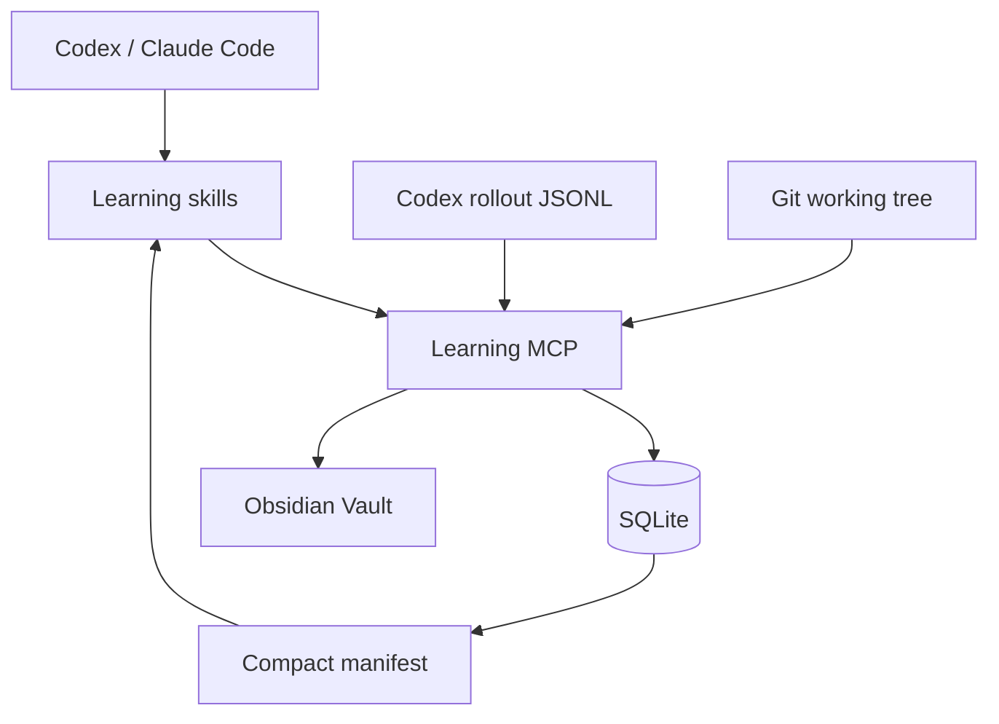
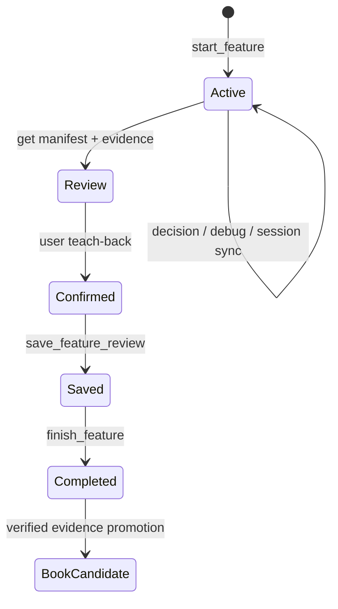

# Learning MCP 아키텍처

## 책임 분리

- `LearningService`: feature·결정·디버깅·세션·리뷰 유스케이스
- `Database`: SQLite 스키마와 트랜잭션 경계
- `codex_usage`: 누적 토큰 snapshot의 delta 계산과 대화 메시지 인덱싱
- `git_tools`: working/staged diff와 commit 증거를 읽기 전용으로 수집
- `obsidian`: 검증 가능한 고정 Markdown 템플릿으로 출력
- `server`: MCP tool/resource 등록만 담당

## 다중 프로젝트 경계

하나의 서버와 DB를 공유하되 host skill이 매 feature 시작 시 현재 작업의 절대 Git 경로를 전달한다. 서버는 `git rev-parse --show-toplevel`로 경로를 정규화하고 검증한 뒤 feature에 저장한다. 이후 diff, commit, review는 저장된 경로만 사용한다. 암묵적인 환경변수 기본값으로 MCP feature를 시작하지 않으므로 프로젝트 간 증거 혼입을 막는다.

## 토큰 절약

1. `get_feature_manifest`는 목표, 범위, Git stat, token 합계, evidence ref만 반환한다.
2. Agent는 필요한 ref만 `get_evidence`로 가져온다.
3. evidence는 한 번에 최대 10개, 서버 설정상 최대 12,000자다.
4. 대화 원문은 SQLite evidence로 저장하지만 manifest에는 240자 요약만 나온다.
5. Obsidian 저장 도구는 작성한 전체 Markdown 대신 경로와 hash만 반환한다.
6. 기본 리뷰는 Agent 한 번으로 끝내고 전문 skill은 필요할 때만 호출한다.

## feature 생명주기

## 기여도

영역은 `requirements`, `architecture`, `implementation`, `debugging`, `testing`입니다.

판정값:

- `human-led`
- `shared`
- `ai-led-verified`
- `ai-led-unverified`

자동 판정은 증거와 신뢰도를 가진 제안일 뿐이며 사용자의 확인이 최종입니다.

## 현재 한계

- Codex는 rollout JSONL의 누적 token snapshot을 지원하지만 다른 provider는 adapter가 아직 없습니다.
- `latest` 세션 선택은 병렬 Codex 세션이 없을 때만 안전합니다.
- 코드 line별 AI 작성자 판정은 하지 않습니다. 대화·tool patch·사용자 확인을 함께 보지 않으면 오판 가능성이 높기 때문입니다.
- MCP가 host의 전체 대화를 직접 볼 수 없으므로 시작·종료 시 session sync가 필요합니다.
- LangGraph는 사용하지 않습니다. 사용자 승인 분기와 중단·재개가 복잡해질 때만 도입합니다.
