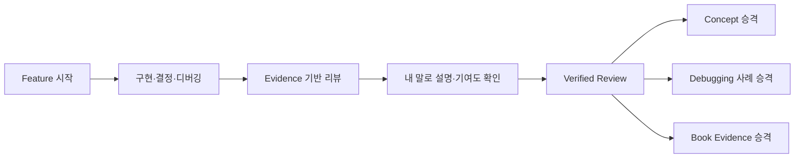

# 🧭 Learning MCP 학습 대시보드

AI와 함께 개발한 feature 리뷰를 프로젝트별로 모아 보고, 검증 대기·반복 약점·다음 학습 주제를 확인하는 진입점이다.

- [[learning/README|처음 사용하는 법]]
- [[../../HOME|Vault 홈]]

> [!tip] 이 대시보드의 우선순위
> 새 학습거리를 찾기 전에 `확인이 필요한 리뷰`를 먼저 비운다. 검증 대기는 최대 3개, 이번 주 새 학습 주제는 최대 1개만 유지한다.

> [!info] 보이는 범위
> 이 대시보드는 SQLite의 active feature를 직접 읽지 않는다. `save_feature_review`가 Obsidian에 내보낸 `type: feature-learning-review` 노트부터 표시한다.

## 학습 흐름



## 확인이 필요한 리뷰

```dataview
TABLE WITHOUT ID
  file.link AS "리뷰",
  project AS "프로젝트",
  feature_id AS "Feature",
  started AS "시작",
  tokens.total_tokens AS "토큰"
FROM "dev/wiki/projects"
WHERE type = "feature-learning-review" AND status = "needs-confirmation"
SORT started DESC
```

## 최근 검증된 리뷰

```dataview
TABLE WITHOUT ID
  file.link AS "리뷰",
  project AS "프로젝트",
  feature_id AS "Feature",
  ownership.architecture AS "아키텍처",
  ownership.debugging AS "디버깅",
  tokens.total_tokens AS "토큰"
FROM "dev/wiki/projects"
WHERE type = "feature-learning-review" AND status = "verified"
SORT started DESC
LIMIT 20
```

## 프로젝트별 리뷰 수

```dataview
TABLE length(rows) AS "리뷰 수"
FROM "dev/wiki/projects"
WHERE type = "feature-learning-review"
GROUP BY project
SORT length(rows) DESC
```

## 최근 일일 개발 회고

```dataview
TABLE WITHOUT ID
  file.link AS "일일 회고",
  project AS "프로젝트",
  date AS "날짜"
FROM "dev/wiki/learning/daily"
WHERE type = "daily-development-learning"
SORT date DESC
LIMIT 14
```

## Learning MCP가 발견한 개념

```dataview
TABLE WITHOUT ID
  file.link AS "개념",
  concept_id AS "ID",
  first_seen AS "처음 등장"
FROM "dev/wiki/concepts"
WHERE type = "dev-concept" OR type = "cs-concept"
SORT first_seen DESC
LIMIT 20
```

## 약점과 다음 학습 주제

```dataview
TABLE WITHOUT ID
  file.link AS "리뷰",
  project AS "프로젝트",
  weaknesses AS "약점",
  next_topics AS "다음 주제"
FROM "dev/wiki/projects"
WHERE type = "feature-learning-review" AND length(weaknesses) > 0
SORT started DESC
LIMIT 30
```

## 빠른 실행 문장

### Feature 시작

```text
$learning-session 이 기능을 feature 단위로 기록하면서 개발하자.
아키텍처와 디버깅 판단은 내가 하고 반복 구현은 AI가 도와줘.
```

### 리뷰

```text
$feature-review 현재 feature의 staged 변경을 리뷰해줘.
코드 흐름과 기술 대안, 사람/AI 기여도를 구분해줘.
```

### 디버깅

```text
$debugging-coach 이 증상에 대해 내가 먼저 가설을 세우고 검증하도록 도와줘.
```

### 책 증거 승격

```text
$promote-feature-to-book 검증된 feature 리뷰를 챕터 후보 증거로 정리해줘.
```

## 승격 목적지

- 일반화 가능한 개념 → [[concepts/|Concepts]]
- 실제 가설·검증 사례 → [[debugging/|Debugging]]
- 프로젝트별 책 증거 → `dev/wiki/projects/<project>/book-evidence/`
- 운영 규칙 → [[projects/_feature-review-guide|Feature 리뷰 운영 가이드]]
- 책 집필 검증 → [[../../skill and agent/learning-evidence-curator|Learning Evidence Curator]]
