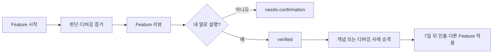

# Obsidian × Learning MCP 사용법

Learning MCP는 개발 기록을 쌓는 도구가 아니라, 내가 내린 판단과 검증 과정을 다시 꺼내 쓰게 만드는 도구다.



## 폴더 역할

- `daily/`: MCP가 만든 일일 개발 회고. 할 일을 추가하는 곳이 아니라 하루의 판단을 압축하는 곳.
- `../../projects/<project>/features/`: Feature별 자동 리뷰. 자동 생성 영역은 직접 수정하지 않는다.
- `../../concepts/`: 여러 Feature에 재사용할 수 있는 원리.
- `../../debugging/`: 실제 증상, 가설, 최소 실험, 결과가 모두 있는 사례.

## Feature마다 할 일

### 시작

일반적인 기능·버그 수정·리팩터링 요청을 하면 Agent가 active Feature를 확인하고 자동으로 시작하거나 이어간다. 사용자가 `$learning-session`을 직접 입력할 필요는 없다.

- 성공 조건 1~3개는 요청에서 자동 추론한다.
- 제품 의도와 되돌리기 어려운 판단은 사용자 영역으로 남긴다.
- 같은 결과에 속한 후속 요청은 기존 Feature에 이어서 기록한다.
- 다른 결과로 넘어가는 경계가 애매할 때만 사용자에게 확인한다.

### 종료

- 완료 신호가 확인되면 최종 Git 증거와 draft 리뷰가 자동으로 예약된다.
- 사용자는 나중에 실행 흐름을 자기 말로 3~5문장 설명한다.
- 기여도 판정을 확인한 뒤에만 `verified`로 바꾼다.
- 다음 학습 주제는 최대 하나만 선택한다.

## 주간 20분 정리

1. [[../learning-dashboard|대시보드]]에서 `needs-confirmation`을 먼저 처리한다.
2. 반복해서 나온 개념 하나만 `concepts/`로 승격한다.
3. 가설과 검증이 있었던 오류 하나만 `debugging/`으로 승격한다.
4. 지난 개념 하나를 노트 없이 설명하고 실제 코드 위치를 찾는다.

> [!warning] 학습 부채 신호
> 검증 대기 리뷰가 3개를 넘거나, 다음 학습 주제가 2개 이상 쌓이거나, 한 번도 다시 쓰지 않은 개념 노트가 계속 늘면 새 노트 생성을 멈추고 확인·인출을 먼저 한다.

## 자주 쓸 요청

```text
로그인 API 구현해줘.
```

```text
$debugging-coach 답을 바로 주기 전에 내가 가설을 세우도록 도와줘.
```

```text
$feature-review 내가 코드 흐름을 설명한 뒤 verified로 저장해줘.
```
